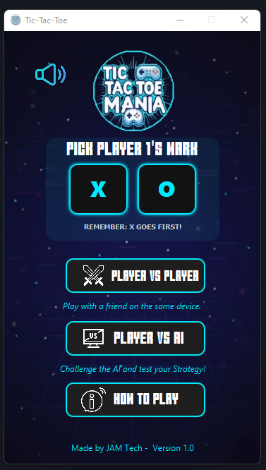
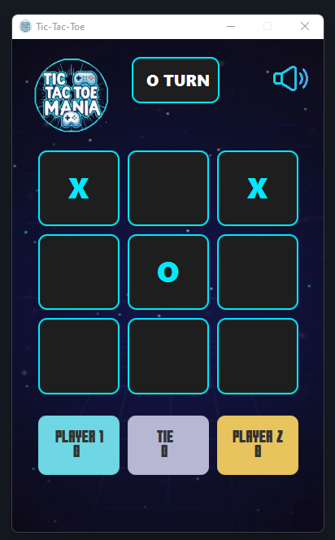
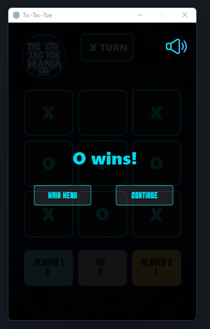
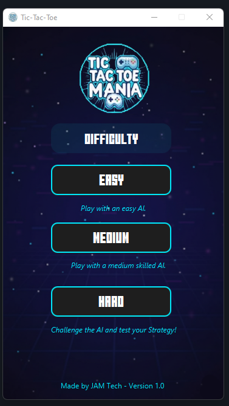
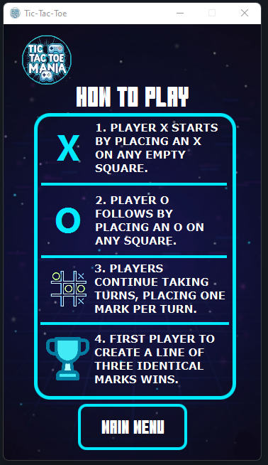

# Tic Tac Toe Desktop Game (Java)

A **Tic Tac Toe** desktop application built in **Java** using **Object-Oriented Programming (OOP)** concepts. Developed as a **BSIT 2nd Year project**, I was the **main developer**, while my groupmates handled the **UI/UX design**.

---

## ✨ Features
- Player vs Player mode
- Player vs AI mode
  - Easy
  - Medium
  - Hard
- Choose X or O
- Instructions screen
- Background music
- Mute / Unmute toggle
- Clean interface

---

## 🛠 Tech Used


---

## 🖼 Screenshots

### Menu


### Gameplays




### AI Difficulty


### Instructions


---


## 🚀 How to Run
1. Clone the repository
```
git clone https://github.com/YOURUSERNAME/tic-tac-toe-java.git
```

2. Open in IntelliJ IDEA

3. Run:
```
Main.java
```
